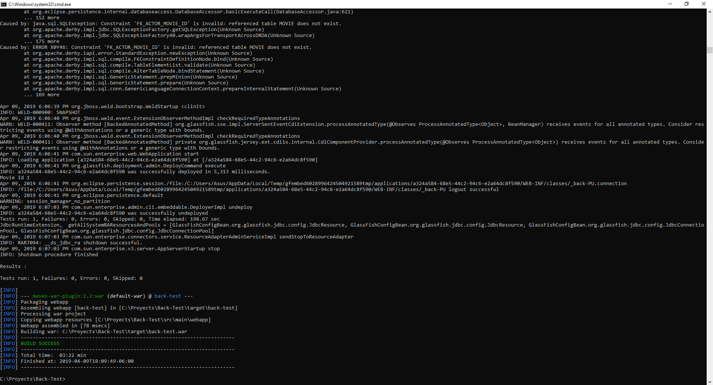
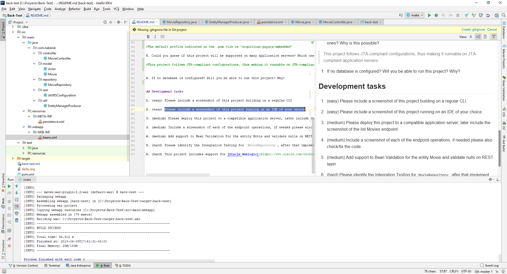
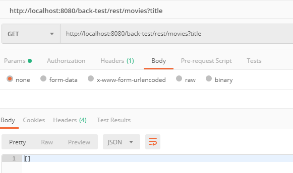
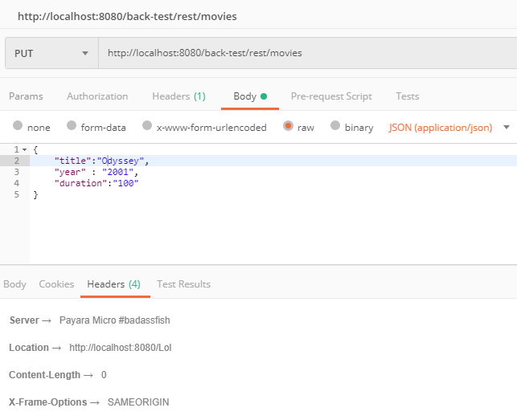
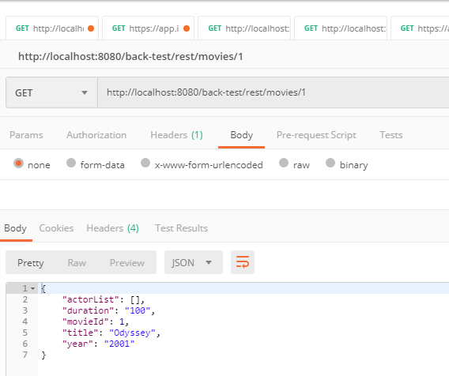
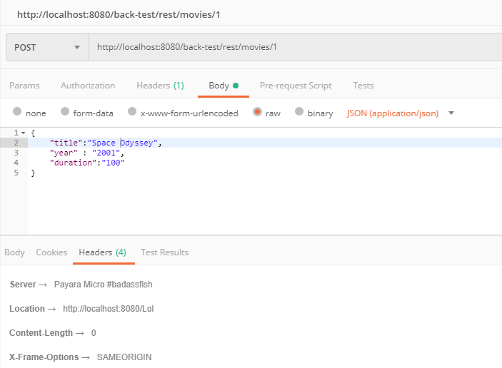
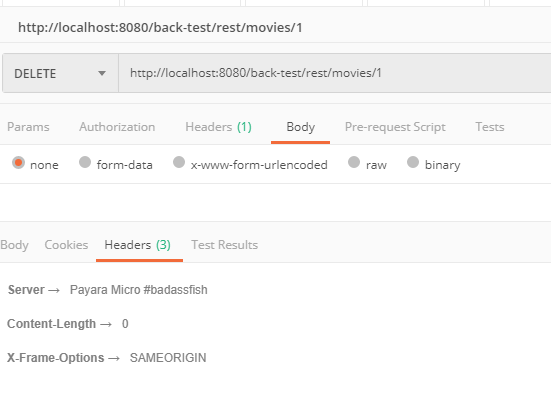

# Nabenik's Java EE basic test

Hi and welcome to this test. As many technical interviews, main test objective is to determine your actual EE skill, being:

- General Java knowledge
- General toolkits, SDK's and other usages
- Java EE general skills

To complete this test, please create a fork of this repository, commit the solutions/answers to YOUR copy and finally do a pull request to the original repo.

The document is structured using [GitHub Markdown Flavor](https://github.com/adam-p/markdown-here/wiki/Markdown-Cheatsheet#code).

## General questions

1. How should you answer these questions?

   > Like this (Yes, like this)

   Or maybe with code

   ```kotlin
   fun hello() = "world"
   ```

2. Please enumerate al least 3 Java EE APIs being used at this project, also define it's main objective
   >Enterprise JavaBeans (EJB): Allows the use JavaBeans to make units of related logic that can be grouped together. 

   >JavaServer Pages (JSP): Allows to add sections of servlet code into text documents like HTML

   >Java Persistence API (JPA): Allows the use of a ORM, including a special query language and maping of data to objects  

3. Which of the following is not an application server?

   * Tomcat
   * Undertow
   * Grizzly
   * **~~Netty~~**

   >Netty is not an application server, is a framework for network applications

4. This project defines two main profiles. Which one will be the default if -P argument is not used on Maven?

   >The default profile indicated on the .pom file is "arquillian-payara-embedded"

5. Could you guess if this project will be supported on many application servers? Which ones? Why is this possible?

   >This project follows JTA-compliant configurations, thus making it runnable on JTA-compliant application servers

6. If no database is configured? Will you be able to run this project? Why?
   >The project is configurated to create a temporal test DB creating the models and relations with the metadata of the models, this does not require a traditional database 

## Development tasks

1. (easy) Please include a screenshot of this project building on a regular CLI

   

2. (easy) Please include a screenshot of this project running on an IDE of your choice

   

3. (medium) Please deploy this project to a compatible application server, later include the screenshot of the list Movies endpoint
   
   >Deployed on payara micro

4. (medium) Include a screenshot of each of the endpoint operations, if needed please also check/fix the code
   
   >Create a movie

   
   >Read the movie data

   
   >Update the data

   
   >Delete the data

5. (medium) Add support to Bean Validation for the entity Movie and validate nulls on REST layer

6. (hard) Please identify the Integration Testing for `MovieRepository`, after that implement each of the non-included CRUD methods

7. (hard) This project includes support for [Oracle Weblogic](https://www.oracle.com/technetwork/middleware/weblogic/downloads/wls-main-097127.html), please include a screenshot with your modifications being tested with Weblogic 